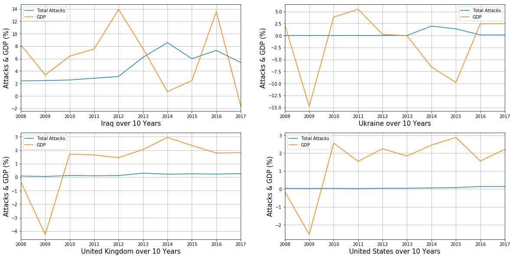

```python
import numpy as np
import pandas as pd
import matplotlib.pyplot as plt
import seaborn as sns
%matplotlib inline
```


```python
terrorRaw = pd.read_csv('GTD_Data/gtd_0717_final.csv', encoding='ISO-8859-1')
del terrorRaw['Unnamed: 0']
mergedData = pd.read_csv('GTD_Data/gtd_gdp_final_analysis.csv')
del mergedData['Unnamed: 0']
mergedData.dropna()
mergedData.head(12)
```


<div>
<style scoped>
    .dataframe tbody tr th:only-of-type {
        vertical-align: middle;
    }

    .dataframe tbody tr th {
        vertical-align: top;
    }

    .dataframe thead th {
        text-align: right;
    }
</style>
<table border="1" class="dataframe">
  <thead>
    <tr style="text-align: right;">
      <th></th>
      <th>Year</th>
      <th>Country</th>
      <th>Total Attacks</th>
      <th>Casualities</th>
      <th>GDP</th>
    </tr>
  </thead>
  <tbody>
    <tr>
      <th>0</th>
      <td>2008</td>
      <td>Australia</td>
      <td>3.0</td>
      <td>0.0</td>
      <td>3.657944</td>
    </tr>
    <tr>
      <th>1</th>
      <td>2008</td>
      <td>China</td>
      <td>20.0</td>
      <td>189.0</td>
      <td>9.654289</td>
    </tr>
    <tr>
      <th>2</th>
      <td>2008</td>
      <td>Colombia</td>
      <td>133.0</td>
      <td>323.0</td>
      <td>3.257048</td>
    </tr>
    <tr>
      <th>3</th>
      <td>2008</td>
      <td>Georgia</td>
      <td>33.0</td>
      <td>75.0</td>
      <td>2.418572</td>
    </tr>
    <tr>
      <th>4</th>
      <td>2008</td>
      <td>Iraq</td>
      <td>1106.0</td>
      <td>9414.0</td>
      <td>8.228107</td>
    </tr>
    <tr>
      <th>5</th>
      <td>2008</td>
      <td>Pakistan</td>
      <td>568.0</td>
      <td>2941.0</td>
      <td>1.701405</td>
    </tr>
    <tr>
      <th>6</th>
      <td>2008</td>
      <td>Philippines</td>
      <td>276.0</td>
      <td>601.0</td>
      <td>4.152757</td>
    </tr>
    <tr>
      <th>7</th>
      <td>2008</td>
      <td>Somalia</td>
      <td>172.0</td>
      <td>966.0</td>
      <td>NaN</td>
    </tr>
    <tr>
      <th>8</th>
      <td>2008</td>
      <td>Ukraine</td>
      <td>1.0</td>
      <td>2.0</td>
      <td>2.304029</td>
    </tr>
    <tr>
      <th>9</th>
      <td>2008</td>
      <td>United Kingdom</td>
      <td>39.0</td>
      <td>8.0</td>
      <td>-0.345861</td>
    </tr>
    <tr>
      <th>10</th>
      <td>2008</td>
      <td>United States</td>
      <td>18.0</td>
      <td>15.0</td>
      <td>-0.136580</td>
    </tr>
    <tr>
      <th>11</th>
      <td>2008</td>
      <td>NaN</td>
      <td>NaN</td>
      <td>NaN</td>
      <td>4.231600</td>
    </tr>
  </tbody>
</table>
</div>


## Regression plot for checking the relation between Total Attacks and GDP


```python
sns.regplot(x="Total Attacks", y="GDP", data=mergedData)
# plt.scatter(mergedData['Total Attacks'], mergedData['GDP'])
fig = plt.gcf()
fig.set_size_inches(10,8)
```


```python
plt.figure(figsize= (25, 15))
xaxis = terrorRaw["Country"].value_counts().index
yaxis = terrorRaw["Country"].value_counts().values
sns.barplot(xaxis, yaxis, palette = 'inferno')
plt.xticks(fontsize = 14)
plt.yticks(fontsize = 16)
plt.xlabel('Country', fontsize = 25)
plt.ylabel('Numbers of Attacks', fontsize = 25)
plt.title('Numbers of Attacks by Each Country ( Ranked by Top in Region )', fontsize = 30)
```


    Text(0.5, 1.0, 'Numbers of Attacks by Each Country ( Ranked by Top in Region )')


```python
topCountry = terrorRaw[terrorRaw['Country'].isin(terrorRaw['Country'].value_counts().index)]
pd.crosstab(topCountry.Year, topCountry.Country).plot(color = sns.color_palette('bright',10))
fig = plt.gcf()
fig.set_size_inches(20,10)
```


## Plotting data for some countries to see if there is any relation between GDP and Total Attacks happened over the period of 10 years


```python
# https://matplotlib.org/devdocs/gallery/subplots_axes_and_figures/subplots_demo.html
# https://matplotlib.org/3.1.1/tutorials/introductory/usage.html#sphx-glr-tutorials-introductory-usage-py
#fig, (ax1, ax2) = plt.subplots(1, 2)
fig, ((ax1, ax2), (ax3, ax4)) = plt.subplots(2, 2)

DF = mergedData.loc[mergedData['Country'] == 'Australia']
ax1.plot(DF['Year'], DF['Total Attacks'], label='Total Attacks')
ax1.plot(DF['Year'], DF['GDP'], label='GDP')
ax1.grid(True)
ax1.legend()
ax1.set_xlim(2008, 2017)
ax1.set_xlabel('Australia over 10 Years', fontsize = 20)
fig = plt.gcf()
fig.set_size_inches(20,10)

DF = mergedData.loc[mergedData['Country'] == 'China']
ax2.plot(DF['Year'], DF['Total Attacks'], label='Total Attacks')
ax2.plot(DF['Year'], DF['GDP'], label='GDP')
ax2.grid(True)
ax2.legend()
ax2.set_xlim(2008, 2017)
ax2.set_xlabel('China over 10 Years', fontsize = 20)
fig = plt.gcf()
fig.set_size_inches(20,10)

DF = mergedData.loc[mergedData['Country'] == 'Georgia']
ax3.plot(DF['Year'], DF['Total Attacks'], label='Total Attacks')
ax3.plot(DF['Year'], DF['GDP'], label='GDP')
ax3.grid(True)
ax3.legend()
ax3.set_xlim(2008, 2017)
ax3.set_xlabel('Georgia over 10 Years', fontsize = 20)
fig = plt.gcf()
fig.set_size_inches(20,10)

DF = mergedData.loc[mergedData['Country'] == 'Pakistan']
ax4.plot(DF['Year'], DF['Total Attacks'], label='Total Attacks')
ax4.plot(DF['Year'], DF['GDP'], label='GDP')
ax4.grid(True)
ax4.legend()
ax4.set_xlim(2008, 2017)
ax4.set_xlabel('Pakistan over 10 Years', fontsize = 20)
fig = plt.gcf()
fig.set_size_inches(20,10)

fig, ((ax5, ax6), (ax7, ax8)) = plt.subplots(2, 2)

DF = mergedData.loc[mergedData['Country'] == 'Iraq']
ax5.plot(DF['Year'], DF['Total Attacks'], label='Total Attacks')
ax5.plot(DF['Year'], DF['GDP'], label='GDP')
ax5.grid(True)
ax5.legend()
ax5.set_xlim(2008, 2017)
ax5.set_xlabel('Iraq over 10 Years', fontsize = 20)
fig = plt.gcf()
fig.set_size_inches(20,10)

DF = mergedData.loc[mergedData['Country'] == 'Ukraine']
ax6.plot(DF['Year'], DF['Total Attacks'], label='Total Attacks')
ax6.plot(DF['Year'], DF['GDP'], label='GDP')
ax6.grid(True)
ax6.legend()
ax6.set_xlim(2008, 2017)
ax6.set_xlabel('Ukraine over 10 Years', fontsize = 20)
fig = plt.gcf()
fig.set_size_inches(20,10)

DF = mergedData.loc[mergedData['Country'] == 'United Kingdom']
ax7.plot(DF['Year'], DF['Total Attacks'], label='Total Attacks')
ax7.plot(DF['Year'], DF['GDP'], label='GDP')
ax7.grid(True)
ax7.legend()
ax7.set_xlim(2008, 2017)
ax7.set_xlabel('United Kingdom over 10 Years', fontsize = 20)
fig = plt.gcf()
fig.set_size_inches(20,10)

DF = mergedData.loc[mergedData['Country'] == 'United States']
ax8.plot(DF['Year'], DF['Total Attacks'], label='Total Attacks')
ax8.plot(DF['Year'], DF['GDP'], label='GDP')
ax8.grid(True)
ax8.legend()
ax8.set_xlim(2008, 2017)
ax8.set_xlabel('United States over 10 Years', fontsize = 20)
fig = plt.gcf()
fig.set_size_inches(20,10)
```





```python

```
